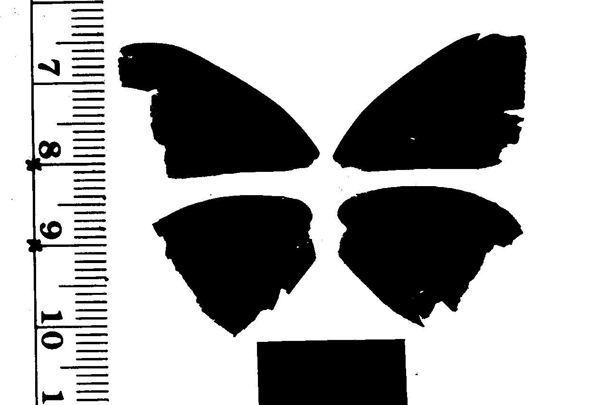
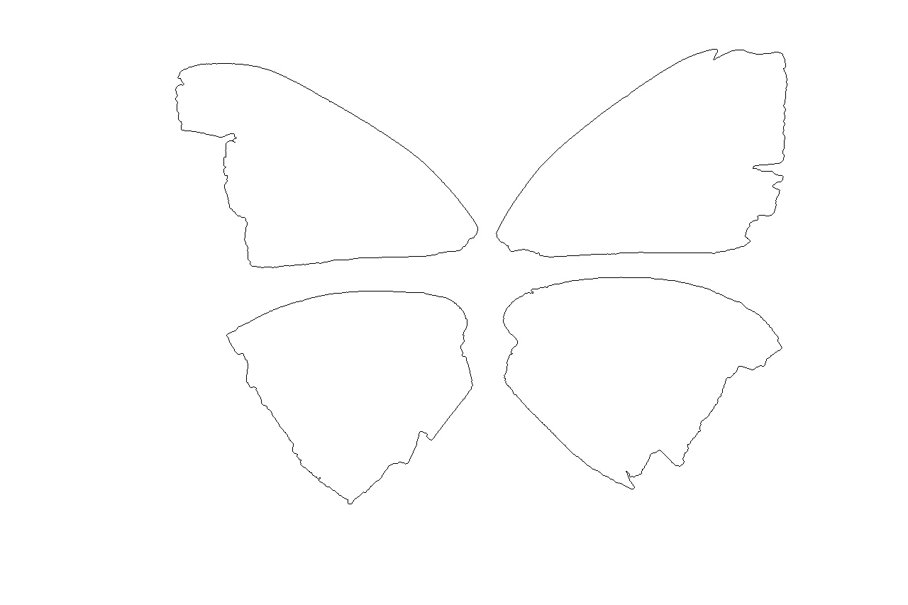
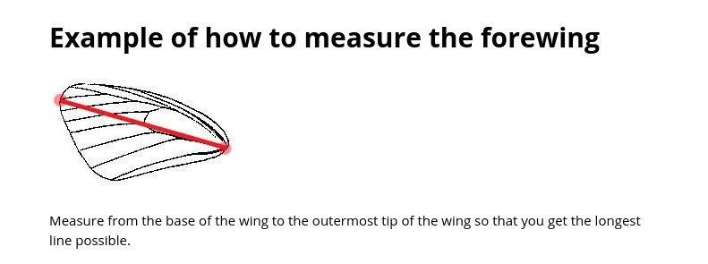

******************
Graphical Analysis
******************

In this section, we'll talk about some techniques that can be used to automatically do some common tasks in Zooniverse projects. You can try adapting these techniques to your project - the aim is reduce the number of subjects/tasks that you actually need volunteers to process.
This can make a significant difference in how long a project needs to complete and also (hopefully) make for happier volunteers by getting rid of the "unnecessary" work. For example, users may be bored in they need to watch 50 30-second clips of worms before they see an egg laid. It would be great if we could prune away 45 clips (for example).
This section doesn't actually talk about Worm Watch - it was just an example I recently came across and I know the Worm Watch researchers have some cool ideas for how they want to reduce the volunteers' work.

These ideas may only work some of the time - that's fine. As long as we can identify when the techniques fail (not always a trivial thing), we can give those subjects to the users.

All of the code below is in Python and uses common libraries such as openCV and numpy.

Let's start with the following image of some butterfly wings:

.. image:: images/butterfly1.jpeg
    :width: 300px
    :align: center
    :height: 300px
    :alt: alternate text

Our first task is to measure the length of the wings. To do so, we first need to "extract" the wings from the image. The background is a nice distinctive pink. Each pixel has 3 values (known the RGB values which give the red, green and blue intensities of that pixel). For the background, an example pixel is (211,44,124).
(I found this by opening the image in Gimp - a Linux graphics editor. ) We'll use this as the background reference colour - the background is so different from the wings that the exact reference colour really doesn't matter. We'll calculate the difference between every pixel in the image
and this reference colour. If the difference is large enough, we have a "foreground" pixel (wing, ruler or card). We'll start by using openCV to load the image (can also use Matplotlib or probably a bunch of other libraries) ::

    import cv2
    image = cv2.imread(file_name)

The image is now loaded as a Numpy array with size height x width x 3. Each pixel is actually a value in R^3 and so the difference between a pixel and our reference value is the Euclidean distance between the two ::

    import numpy as np
    image = np.asarray(image,dtype=np.int)
    distance_per_axis = np.power(image - [211,44,124],2)
    distance_squared = np.sum(distance_per_axis,axis=2)
    distance = np.power(distance_squared,0.5)

The second line converts image such that each pixel now has type "integer". This is really important since originally each pixel had type "unsigned integer 8" (np.uint8). Unsigned integers cannot have negative values which can cause trouble with our calculations. np.uint8 is the starting type for any loaded image. (8 means that the maximum brightness for a pixel is (2^8-1,2^8-1,2^8-1) or (255,255,255) which is white.)
The third through fifth lines then calculate the Euclidean distance from each pixel to our reference pixel. We could have done this with a loop but using numpy is much faster and gives cleaner code.

The variable distance is now a matrix of size height x width with each cell value having type 'numpy.float64' (a real number). Functions that we'll use later on require us to convert back to numpy.uint8 so we'll do that now ::

    distance = np.uint8(255 - cv2.normalize(distance,distance,0,255,cv2.NORM_MINMAX))

Not sure exactly why "distance" needs to be used 3 times, the openCV documentation isn't great. The distance calculation gives foreground pixels high values (the higher the value, the more white the pixel) but we want foreground pixels to be black. So we need to invert the image - hence the "255-".

Finally, we apply a threshold - map each pixel to be either 0 or 255 (instead of ranging between those values). We'll use binary thresholding which takes a given threshold - if a pixel is below that threshold, it gets maps to 0. Otherwise the pixel is mapped to 255.
If you don't want to rely on choosing a threshold, look into Otsu's binarization (i haven't played with it for this particular problem but seems like a good possibility). However, for our problem there is such a large difference between foreground and background pixel (and that difference is pretty constant over multiple images) that I choose a threshold of 200 and it worked fine ::

    _,distance = cv2.threshold(distance,200,255,cv2.THRESH_BINARY)

The "_" means that cv2 is returning another value that I don't care about. To save the image, we can use ::

    cv2.imwrite(file_name,distance)

Technically we could also matplotlib but I wouldn't recommend it - the image will get shrunk by borders and it is a complete pain to deal with. The image looks like

So we've extracted the foreground (wings, ruler and card). Next we need to identify the wings specifically. We can use heuristics such as "all the pixels in the ruler have x-values less than 300" (this seems to be a pretty good heuristic from my experience with these particular subjects). But for now we'll proceed without such heuristics.
We'll extract the contours of the above image - the outlines of each blob - using openCV ::

    _,contour, _ = cv2.findContours(distance.copy(),cv2.RETR_TREE,cv2.CHAIN_APPROX_SIMPLE)

See http://docs.opencv.org/3.1.0/d4/d73/tutorial_py_contours_begin.html#gsc.tab=0 for a discussion about the details of how to find contours (and neat things you can do with them). A couple of points

* findContours actually destroys the image you pass in. So if we wanted to use "distance" again, we actually need to give findContours a copy. (hence .copy())
* if you read the documentation, you will come across the idea of setting the second parameter to cv2.RETR_EXTERNAL (instead of cv2.RETR_TREE) which may seem like a good idea but sometimes can give weird results. My rule of thumb is that unless you specifically want only the external contours (which can happen), DO NOT use cv2.RETR_EXTERNAL

Let's create a white template image (the same dimensions as distance) and draw on the contours. First create the template image ::

    contour_image = np.zeros(image.shape[:2],np.uint8)
    contour_image.fill(255)

And now iterate over all the contours, drawing them on ::

    for cnt in contour:
        x,y,w,h_ = cv2.boundingRect(cnt)
        if 0.5 <= (h_/float(w)) <= 2:
            if 200 <= cv2.arcLength(cnt,True) < 2000:

                cv2.drawContours(contour_image,[cnt],0,0,1)

The two if statements are quick sanity checks. We know that the wings are "roughly" rectangular so if we have a contour plot that is especially narrow (height or width), we can ignore it. I also know that the wings tend to have a parameter of between 200 and 2000 pixels. Any things below that is just noise and anything above that is usefully the ruler. We should be left with 4 contour plots (if not, this is a good subjec to give to the users).

Now that we've done all that, we're ready for the first task that this project wants - a measure of the wing span of top left wing.

One possibility is to simply find the maximum length line between any two points in a contour plot. I found this sometimes gave slightly strange results. We need to make sure that the line goes from the bottom right of the wing to the top left. Let's start by finding the bottom right of the wing. This isn't completely trivial - a point (x,y) might have the lowest x value but not actually be the most "bottom right hand point".
The problem is that there isn't a single mathematical definition for "most bottom right" - we could try lexographical sorting but do we sort first on the y or x axis? Both are perfectly reasonable choices but may give different answers.

Consider a bounding box around top left wing. This box has a clear well defined "most bottom right" point, i.e. the bottom right hand corner. However, this corner probably isn't going to be in the contour plot.