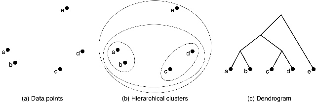

Aggregating Point Markings
##########################

So you have a project with task where people make point markings on an image and you want to aggregate them. For example, with Penguin Watch we might have the image below where the blue dots represent each individual marking made by a user.

[to be inserted]

By aggregation, here we mean "clustering". We want to cluster those markings such that all markings in a cluster correspond to the same penguin and each penguin is represented by at most one cluster. (If no one has marked a penguin, nothing much you can do about that.) So we would hope to find up with the following image

[to be inserted]

Where each red dots represents a single unique penguin. Note that with Penguin Watch there are different markings for adult vs. chick penguins. People are pretty good at correctly marking the type of penguin but not perfect - and for other projects, this sort of task could be much more difficult.
One possibility is, after each marking, ask users whether it is an adult or chick penguin - this would double the number of clicks users make. So for now, we'll ignore the penguin type associated with each marking and come back later to the issue of penguin type classification. (I'll probably use Penguin Watch as running example for this page.)

There are a tonne of clustering algorithms out there. We originally tried `dbscan <https://en.wikipedia.org/wiki/DBSCAN>`_ but there are a couple of problems with it.

* dbscan has two parameters - epsilon and minpts. Having to search for two optimal parameters is tedious and neither of those parameters is completely intuitive (minPts is not the same as minimum cluster size)
* values of epsilon and minpts that work for one image, might not work for another. Images may even require different values for different regions of that image.

The Zooniverse Aggregation Engine uses a modified version of `agglomerative clustering <https://en.wikipedia.org/wiki/Hierarchical_clustering>`_. Every marking starts off in a singleton cluster and then we repeatedly merge clusters until we have only one cluster remaining. The image `below <http://iss.ices.utexas.edu/?p=projects/galois/benchmarks/agglomerative_clustering>`_ shows an exmaple of agglomerative clustering in action.

So we see that we started by merging {A} {B} (brackets indicate sets) into {AB} (or possibly {c} and {d} into {cd}) and repeaded the process until we reached a single "grand" cluster. To use agglomerative clustering, there are two things we need to decide:

* which clusters to merge
* when to stop merging clusters.

There are several different implementations of agglomerative clustering available in Python (and other languages). Two of the more popular ones are from `scikit-learn <http://scikit-learn.org/stable/modules/clustering.html>`_ and `scipy <http://docs.scipy.org/doc/scipy/reference/cluster.hierarchy.html>`_. We used the Scipy one since it offers more control over the clustering process.
These clustering packages offer several built in methods for deciding which clusters to merge. We used the `Ward method <https://en.wikipedia.org/wiki/Ward%27s_method>`_ which usually results in the most balanced tree structure (scikit-learn has a good comparison of the different approaches).

The "grand" cluster isn't actually very meaningful. The `dendrogram <https://en.wikipedia.org/wiki/Dendrogram>`_ in the image above gives a tree based representation of agglomerative clustering. The grand cluster is the root of the tree and the singleton clusters are the leaves of the tree. We want clusters that fall somewhere between these two extremes.
We'll use the very simple rule of thumb that a user will never mark the same penguin twice. This isn't always true but actually holds very well in practice. And later we'll talk about methods for dealing with exceptions.
So if {A} and {B} have users in common, we don't merge those clusters. Another rule of thumb - with enough users, given two nearby penguins, there will be at least one user who has marked both. So if {A} and {B} don't have any users in common,
they probably refer to the same penguin and those clusters should be merged. What are "enough users"? There has been some quantitative analysis done in the past that will be either written up in a paper and/or posted here. But for now, I'll say that if 10-15 users have seen an image, this second RoT will hold.

The code for agglomerative clustering is in agglomerative.py. The file contains the class Agglomerative with a couple of key methods

* __cluster__ - this is the method called by the Aggregation Engine
* __agglomerative__ - this is the method which does the initial agglomerative clustering
* __tree_traverse__ - this method traverses the dendrogram returned by __agglomerative__ looking for "complete clusters" - clusters which should not be merged

\__agglomerative__
******************

This function basically just calls the scipy's implementation of agglomerative clustering. The function also wraps the data in a `Pandas <http://pandas.pydata.org/>`_ dataframe which seems to be necessary for scipy.

\__tree_traverse__
******************

Scipy returns a dendogram which is a tree representation of the agglomerative clustering process. This dendrogram is returned in list format. Using the above image as our example, suppose we had given Scipy the list of initial singleton clusters [A,B,C,D,E,].
So cluster {A} has index 0, cluster {B} has index 1, etc. With this setup, Scipy would have returned::

    [[0,1],[2,3],[5,6],[4,7]]

Each element in the list actually has has 4 values, we only care about the first two. Given the initial list of clusters::

    [[A],[B],[C],[D],[E]]

Scipy is giving the indices of which clusters to merge - the resulting merged cluster is then appended to the end of the list. So after the first merger we would have::

    [[A],[B],[C],[D],[E],[A,B]]

Suppose the markings C and D were made by the same user, so they shouldn't be merged. We denote this with::

    [[A],[B],[C],[D],[E],[A,B],None]

Next we merge [A,B] and [C,D] but [C,D] doesn't actually exist (since we replaced [C,D] with None). So in general, if either child is None, the parent will be None as well ::

    [[A],[B],[C],[D],[E],[A,B],None,None]

After the next and final merger, we have::

    [[A],[B],[C],[D],[E],[A,B],None,None,None]

We now go through this list looking for the "complete clusters". For example, A and B both occur twice in this list, but we don't want [A] or [B]. Each of those elements in the list (other than None) is actually a dictionary. To denote a complete cluster, we just add the key "center" which maps to the median x,y value of all the elements in the cluster. (Median is more robust than mean against outliers, e..g is more robust against someone clicking on not the center of the penguin.)
So then we just return all the elements in the above list which have the "center" key.