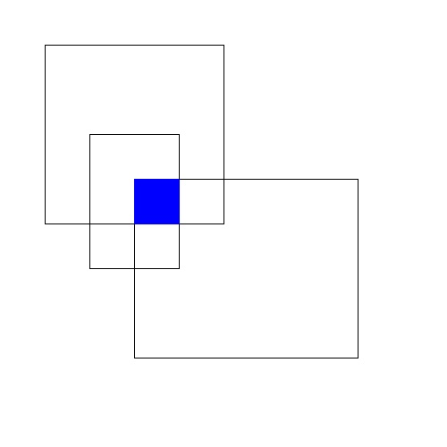
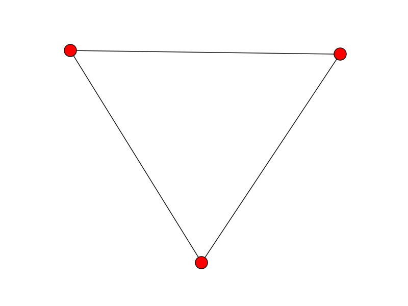

Rectangle Clustering
####################

One of the marking tools available through the PFE is rectangles. This allows users to outline a rectangular region of an image. A rectangle is just a special type of polygon and in fact you can basically use polygon aggregation on rectangles. This turned out to be overkill and rather slow so we created a clustering technique specifically for rectangles.
The code for clustering rectangles is in rectangle_clustering.py

The idea behind rectangle clustering is to find regions that multiple people have outlined. For example, the image below shows 3 overlapping rectangles and the region common to all 3 rectangles is shown in blue. This isn't the greatest example since those 3 rectangles don't really seem to be "referring to the same thing". But probably good to know what happens even when things aren't perfect.

Checking for overlap between rectangles is easy. Two rectangles overlap if and only iff

1. They overlap on the x-axis.
2. They overlap on the y-axis.

Checking for overlap on either axis is straight forward::

    def __overlap__(self,l1,l2):
        (l1_a,l1_b) = l1
        (l2_a,l2_b) = l2
        # l2 ends before l1 begins
        if l2_b < l1_a:
            return False
        # l2 starts after l1 ends
        elif l2_a > l1_b:
            return False
        else:
            return True

We can express the overlap relationship between rectangles as a graph; each node is a rectangle and there is an edge between nodes iff the corresponding rectangles overlap. With this setup, the above rectangular markings can be represented in the below image

A set of nodes where every pair of nodes is connected is called a `clique <https://en.wikipedia.org/wiki/Clique_(graph_theory)>`_. There are actually multiple cliques in the above graph - for example a node by itself is a trivial clique. We want maximal cliques - cliques that are not a subset of another clique. Finding all maximal cliques seems to be an intractable `problem <https://en.wikipedia.org/wiki/Clique_problem#Listing_all_maximal_cliques>`_. So in the worst case, this clustering algorithm could take a long time - but in practice things should be fine.
(I can't imagine more than 50 rectangles per subject and the graph structure should be pretty simple. But if things ever start to run really slowly, this is a place to check.) Because Python is awesome, the code to create a graph, enter edges and enumerate the maximal cliques is just::

    import networkx
    g = networkx.Graph()
    g.add_nodes_from(range(len(markings)))
    g.add_edge(i,j)
    cliques = list(networkx.find_cliques(g))
